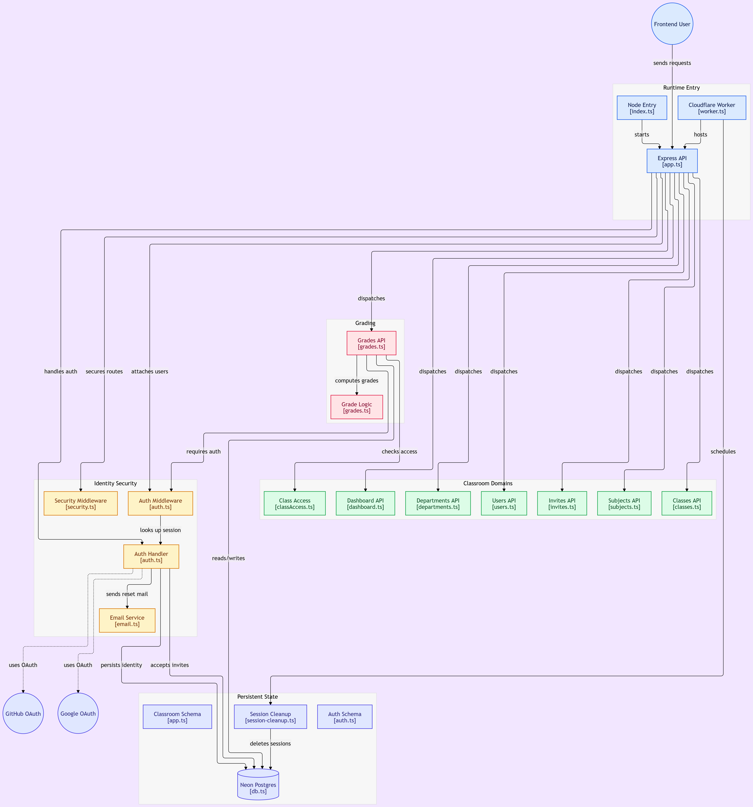

# Classly Backend

## Flow Chart


API server for **Classly**, a role-based classroom management app (admin, teacher, student). It handles auth, the academic catalog, classes & enrollments, email invites, and weighted grades.

## Architecture

```
Browser / Frontend
        │
        │  /api/*  (cookie sessions, credentials: include)
        ▼
┌─────────────────────────────────────────┐
│  Express app (`src/app.ts`)             │
│  ├─ CORS (FRONTEND_URL)                 │
│  ├─ better-auth  →  /api/auth/*         │
│  ├─ attachUser + Arcjet rate limits     │
│  └─ Domain routers → /api/...           │
└──────────────────┬──────────────────────┘
                   │
                   ▼
         Drizzle ORM + Neon Postgres
```

**Dual runtime:** the same Express app runs locally via Node (`src/index.ts`) and on Cloudflare Workers (`src/worker.ts` + Wrangler). Workers also runs a daily cron to clean expired sessions.

There is no separate controller/service layer. Handlers live in `routes/`, query Drizzle schemas in `src/db/schema/`, and share auth, email, and grade helpers under `src/lib/` and `src/middleware/`.

### Stack

| Layer | Choice |
|--------|--------|
| Runtime | Node (local) + Cloudflare Workers (prod) |
| Framework | Express 5 |
| Language | TypeScript (ESM) |
| Database | Neon Postgres via `@neondatabase/serverless` |
| ORM | Drizzle ORM + Drizzle Kit migrations |
| Auth | [better-auth](https://www.better-auth.com/) (email/password, Google, GitHub) |
| Email | Resend (password reset + invites) |
| Security | Arcjet (bot shield + per-role rate limits) |

### Domain model

| Area | Tables |
|------|--------|
| Auth | `user`, `session`, `account`, `verification` |
| Catalog | `departments`, `subjects` |
| Classes | `classes`, `enrollments` |
| Invites | `invitations` |
| Grades | `grade_items`, `student_grades` |

Users have a server-owned `role`: `student` | `teacher` | `admin`. Signup can apply a pending invite (set role + auto-enroll).

### API surface

| Mount | Purpose |
|-------|---------|
| `GET /` | Health check |
| `/api/auth/*` | better-auth (sign-up, sign-in, session, OAuth, password reset) |
| `/api/subjects` | List / create subjects (admin create) |
| `/api/departments` | List departments |
| `/api/users` | Admin user list |
| `/api/classes` | CRUD-ish classes, join by invite code, enrollments |
| `/api/invites` | Create/list invites; public lookup by token |
| `/api/dashboard` | Role-shaped summary (`GET /summary`) |
| `/api/...` (grades) | Grade items + student scores under classes |

Auth middleware: `attachUser` (optional session), `requireAuth`, `requireRole(...)`, plus class ownership/enrollment checks in `middleware/classAccess.ts`.

### Project layout

```
classroom-backend/
├── src/
│   ├── index.ts              # Local Node entry (PORT, default 8000)
│   ├── worker.ts             # Cloudflare Workers entry + cron
│   ├── app.ts                # Express wiring
│   ├── lib/                  # auth, email, grades, session cleanup
│   ├── db/                   # Neon client + Drizzle schemas
│   ├── middleware/           # auth, class access, Arcjet
│   └── config/               # Arcjet config
├── routes/                   # Express routers
├── drizzle/                  # SQL migrations
├── scripts/                  # seed-admin, cleanup, Wrangler helpers
├── wrangler.toml
└── CLOUDFLARE-DEPLOY.md
```

## Getting started

```bash
cd classroom-backend
npm install
cp .env.example .env          # fill in values
npm run db:migrate
npm run seed:admin            # optional first admin
npm run dev                   # http://localhost:8000
```

For Workers locally: copy `.dev.vars.example` → `.dev.vars`, then `npm run cf:dev`.

### Environment

| Variable | Purpose |
|----------|---------|
| `DATABASE_URL` | Neon Postgres connection string |
| `FRONTEND_URL` | CORS origin + better-auth trusted origin |
| `BETTER_AUTH_SECRET` | Auth signing secret |
| `BETTER_AUTH_URL` | Public URL browsers use for `/api/auth` (frontend origin when proxied) |
| `ARCJET_KEY`, `ARCJET_ENV` | Rate limit / bot protection |
| `GOOGLE_*`, `GITHUB_*` | OAuth client credentials |
| `RESEND_API_KEY`, `EMAIL_FROM` | Transactional email |
| `ADMIN_EMAIL`, `ADMIN_PASSWORD`, `ADMIN_NAME` | Used only by `seed:admin` |
| `PORT` | Local listen port (default `8000`) |

When the frontend proxies `/api` (Vite or Vercel), set `BETTER_AUTH_URL` to the **frontend** origin so session cookies stay first-party (`SameSite=Lax`).

## Scripts

| Script | Description |
|--------|-------------|
| `npm run dev` | Watch mode via `tsx` |
| `npm run build` / `start` | Compile and run Node build |
| `npm run db:generate` | Generate Drizzle migrations |
| `npm run db:migrate` | Apply migrations |
| `npm run seed:admin` | Create/promote first admin |
| `npm run cleanup:sessions` | Delete expired sessions |
| `npm run cf:dev` / `deploy` | Cloudflare Workers local / prod |
| `npm run cf:secrets` | Push `.env` secrets to Workers |
| `npm run cf:update-vercel` | Point frontend `vercel.json` at the Worker URL |

## Deploy

Production target is **Cloudflare Workers**. See [CLOUDFLARE-DEPLOY.md](./CLOUDFLARE-DEPLOY.md).

Typical flow: `cf:login` → `cf:secrets` → `deploy`, then update the frontend Vercel `/api` rewrite to the Worker URL.

## How it connects to the frontend

1. Frontend calls `/api/*` with `credentials: "include"`.
2. Locally, Vite proxies `/api` → `http://localhost:8000`.
3. In production, Vercel rewrites `/api` → this Worker so cookies stay same-origin.
4. CORS allows `FRONTEND_URL` with credentials.
